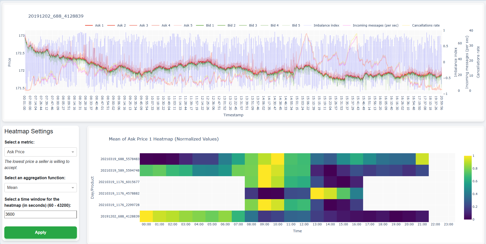
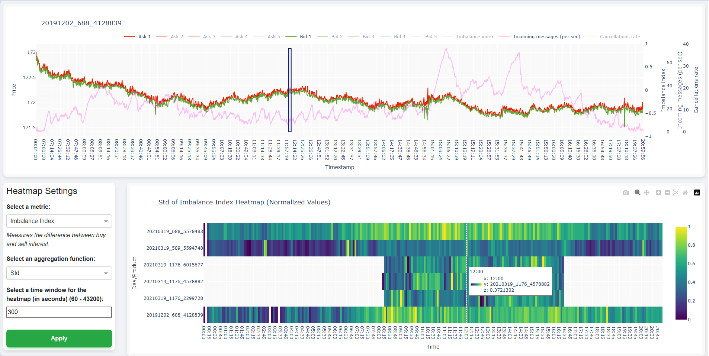

# Limit Order Book Visual Exploration

This is an interactive Python-based visualization tool for exploring high-frequency Limit Order Book (LOB) data.
Originally developed as part of my master's thesis project, the tool supports detailed visual analysis of order flow dynamics and anomaly detection.

See my master's thesis at https://github.com/SpeekeR99/DP_2024_2025_Zappe

## Features

- Dual-view dashboard combining time-series and matrix-based heatmap visualizations
- Interactive exploration:
  - Hover, zoom, and pan across time
  - Drill-down from aggregated views to individual trading days
  - Toggle metrics such as price levels, imbalance index, and message frequency
- Compatible with reconstructed LOB data in LOBSTER-style CSV format
- Built using:
  - Dash for interactive web dashboards
  - Plotly and plotly-resampler for scalable, high-performance time series plots

## Installation

To run the project locally, make sure you have Python 3 installed (Python 3.11 is recommended)

First install the required packages using `pip`.
You can do this by running the following command in your terminal:
```bash
pip install -r requirements.txt
```

## Usage

To run the application, navigate to the project directory in your terminal and execute:
```bash
python src/viz/visuals.py
```

## Screenshots





